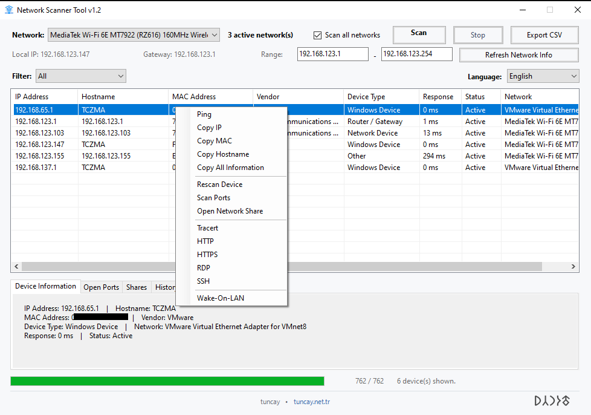
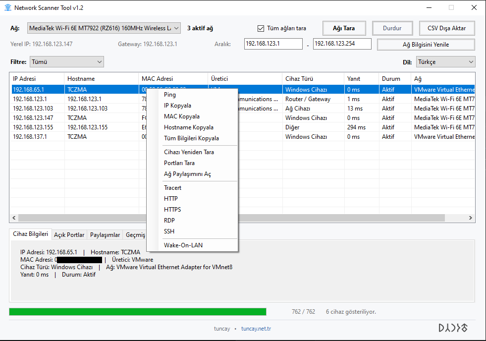

# 🌐 Network Scanner Tool

Fast, lightweight and easy-to-use network scanner for Windows.

Network Scanner Tool discovers devices on your local network and provides
useful information such as IP address, hostname, MAC address, manufacturer,
device type, open ports and network shares.

🇹🇷 Türkçe ve 🇬🇧 English arayüz desteği bulunmaktadır.

---

## ⬇️ Download

### Latest Release — v1.1

👉 [Download Network Scanner Tool](https://github.com/tuncaycandan/NetworkScannerTool/releases/latest)

Precompiled Windows versions are available from the Releases section.

> No installation is required if you download the standalone executable.

---

## ✨ Features

- ⚡ Fast parallel network scanning
- 🌐 Automatic network and IP range detection
- 💻 IP address detection
- 🖥️ Hostname detection
- 🔗 MAC address detection
- 🏭 Vendor / manufacturer identification
- 🔍 Device type detection
- 🔌 Open port scanning
- 📁 Network share scanning
- 📡 Ping
- 🛣️ Traceroute
- 🌍 HTTP / HTTPS access
- 🔐 SSH support
- 🖥️ Remote Desktop (RDP)
- ⚡ Wake-on-LAN
- 🕘 Device scan history
- 📊 CSV export
- 🔎 Device type filtering
- 🇹🇷 Turkish interface
- 🇬🇧 English interface

---

## 🖼️ Screenshots

### 🇬🇧 English Interface

### 🇹🇷 Türkçe Arayüz

---

## 🪟 Supported Operating Systems

| Operating System | Support |
|---|---|
| Windows 7 | ✅ |
| Windows 8 / 8.1 | ✅ |
| Windows 10 | ✅ |
| Windows 11 | ✅ |
| Windows Server | ✅ |

> Some features may depend on the Windows version and installed system
> components. Automatic OpenSSH installation, for example, may not be
> available on older versions of Windows.

---

## 🚀 Usage

1. Download the latest version from **Releases**.
2. Run `NetworkScannerTool.exe`.
3. Select the network adapter you want to scan.
4. Select or enter the desired IP range.
5. Click **Scan Network / Ağı Tara**.
6. Select a discovered device to view detailed information.

Right-clicking a discovered device provides additional network tools.

---

## 🛠️ Available Device Tools

Right-click on a discovered device to access tools such as:

- Ping
- Traceroute
- Scan Ports
- Open Network Share
- HTTP
- HTTPS
- SSH
- Remote Desktop (RDP)
- Wake-on-LAN
- Rescan Device
- Copy IP / MAC / Hostname
- Copy device information

---

## 🔐 SSH Support

Network Scanner Tool can launch SSH connections directly from the device
context menu.

On supported Windows versions, the application can also assist with
installing the Windows OpenSSH Client if it is not already installed.

---

## 🌐 Vendor Detection

Device manufacturers are detected using multiple methods:

1. Local MAC/OUI database
2. Online MAC vendor lookup
3. Hostname-based manufacturer detection

This helps identify manufacturers such as:

- Cisco
- TP-Link
- Ubiquiti
- MikroTik
- Hikvision
- Dahua
- Samsung
- Xiaomi
- Apple
- Synology
- QNAP
- HP
- Epson
- Brother
- and many others

> Devices using randomized/private MAC addresses may not expose their actual
> manufacturer.

---

## 🌍 Languages

The interface can be switched directly from the application:

- 🇹🇷 Türkçe
- 🇬🇧 English

---

## ⚠️ Administrator Privileges

Most scanning features work normally without administrator privileges.

Some Windows networking or system-level operations may require the
application to be run as **Administrator**.

---

## 📦 Source Code

The full source code is available in this repository.

The project is written in **C#** and uses **Windows Forms**.

Contributions, bug reports and suggestions are welcome.

---

## 🐛 Bug Reports & Suggestions

Found a bug or have an idea for a new feature?

Please use:

👉 [GitHub Issues](https://github.com/tuncaycandan/NetworkScannerTool/issues)

When reporting a problem, please include:

- Windows version
- Network Scanner Tool version
- Description of the problem
- Screenshot or error message, if available

---

## 👨‍💻 Author

**Tuncay Candan**

🌐 https://www.tuncay.net.tr

GitHub: [@tuncaycandan](https://github.com/tuncaycandan)

---

## 📄 License

This project is licensed under the **MIT License**.

See the [LICENSE](LICENSE) file for details.

Copyright © 2026 Tuncay Candan
