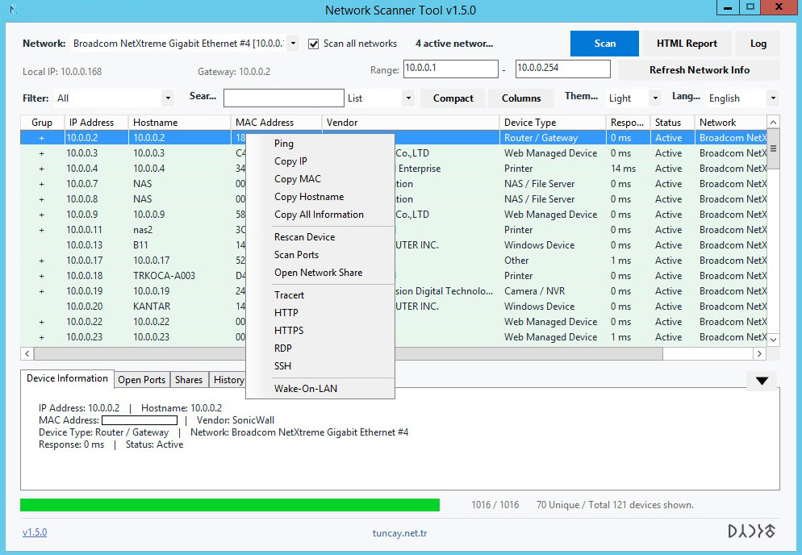
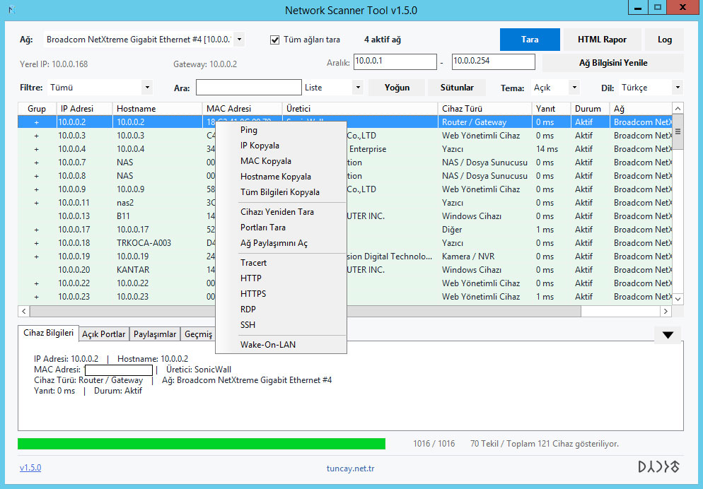

# Network Scanner Tool

Fast, lightweight, and practical network discovery and diagnostics tool for Windows. Network Scanner Tool scans IPv4 ranges, discovers responsive devices, and presents IP address, hostname, MAC address, vendor, device type, response time, network, open ports, shares, and scan history in a single desktop application.

The application provides both **Türkçe** and **English** interfaces and is distributed as a standalone single executable. The current public release is **v1.5.0**.

## Download

Download the latest release from the [Network Scanner Tool v1.5.0 release page][release]. The package contains `NetworkScannerTool.exe`; no installer is required.

> The executable is intended for supported Windows systems with .NET Framework 4.8 available.

## Features

### Network discovery and scanning

- Automatic detection of available IPv4 network adapters, local addresses, masks, gateways, and adapter MAC addresses.
- Scanning of a selected network adapter or all detected networks.
- Manual IPv4 start/end ranges.
- CIDR notation such as `192.168.1.0/24`.
- Dynamic scan concurrency based on the local machine and target count.
- Worker-pool based parallel scanning for large ranges.
- Cancellation support and live progress reporting.
- IP and network/adapter-aware result handling so records from multiple Ethernet networks are preserved.

### Device information

The device list can display IP address, hostname, MAC address, manufacturer, device type, response time, status, and network/adapter information. Device details are completed asynchronously after discovery where additional information is available.

When the same physical device is discovered on multiple networks, records with the same normalized MAC address are grouped under one main row. The **Group** column displays `+` when additional records are available and `-` when the group is expanded. Selecting the indicator opens or closes the other IP and network records without removing them from the results.

The status area reports both counts, for example:

```text
74 Tekil / Toplam 94 Cihaz gösteriliyor.
74 Unique / Total 94 devices shown.
```

The unique count represents grouped physical devices; the total count represents all discovered network records.

### Device list views

The device list includes the following productivity features:

- Quick search across IP, hostname, MAC, vendor, device type, status, and network.
- List view for detailed column-based inspection.
- Card view for compact device summaries.
- Compact and normal row density modes.
- Automatic column sizing.
- Column visibility controls.
- Persistent and clearly visible group indicators.
- Status-based row coloring for active, inactive, searching, and unknown states.
- Sorting through column headers.
- Selection preservation when the list is refreshed or filtered.
- Expandable and collapsible details panel for device information, open ports, shares, and history.

### Device tools

Right-click a discovered device to access available actions, including:

- Ping.
- Traceroute.
- Open HTTP or HTTPS access.
- SSH connection support.
- Remote Desktop (RDP).
- Open network shares.
- Scan common TCP ports.
- Wake-on-LAN.
- Rescan the selected device.
- Copy IP address, MAC address, hostname, or complete device information.

Some actions depend on the target device, local Windows configuration, installed components, and available credentials.

### Reports and history

- HTML report export.
- CSV export.
- Device scan history.
- Open-port and network-share details for the selected device.
- Scan summary with unique and total device counts.

### Update and security

The application uses HTTPS for update downloads and verifies the downloaded executable with SHA-256 before applying it. The update process runs outside the active application process so the running executable can be replaced safely.

During an update, the previous executable is temporarily kept as a `.backup` file. After the new executable is successfully placed and started, the backup is automatically removed. If replacement or startup fails, the backup is retained to support recovery.

Command execution for SSH, traceroute, and RDP-related operations is isolated through the process execution service rather than concatenating untrusted input into shell commands.

## User interface

The application supports two interface languages:

- Türkçe
- English

The upper controls are aligned for consistent spacing and text placement. The lower details area can be collapsed with the arrow control to give the device list more vertical space and expanded again when details are needed.

Screenshots are included in the repository:

- English interface: `ssen.jpg`
- Turkish interface: `sstr.jpg`





## Usage

1. Download `NetworkScannerTool.exe` from the [latest release][release].
2. Start the executable.
3. Select a network adapter, or enable the option to scan all available networks.
4. Enter an IPv4 range or CIDR range, such as `192.168.1.0/24`.
5. Start the scan.
6. Use the search, filter, column, density, and list/card controls to refine the results.
7. Select a device to inspect its details, ports, shares, and history.
8. Use the `+` indicator to expand records for the same MAC address found on other networks.
9. Export the results as HTML or CSV when required.

For a large network, begin with the required adapter or CIDR range and use cancellation if the scan needs to be stopped. Scanning the same physical device through multiple adapters can produce multiple network records; these are intentionally grouped by normalized MAC address rather than discarded.

## Supported environment

| Component | Requirement |
|---|---|
| Operating system | Windows 10, Windows 11, and supported Windows Server versions |
| Runtime | .NET Framework 4.8 |
| Distribution | Standalone single EXE |
| Network | IPv4 connectivity to the ranges being scanned |
| Privileges | Standard user for most operations; administrator privileges may be required for some system-level actions |

SSH, RDP, traceroute, Wake-on-LAN, port scanning, and share discovery can be affected by firewall rules, routing, permissions, installed Windows components, and the configuration of the target device.

## Build from source

The project is a C# Windows Forms application targeting .NET Framework 4.8. Open `NetworkScannerTool.sln` in Visual Studio or build with MSBuild:

```powershell
dotnet msbuild NetworkScannerTool.csproj /t:Rebuild /p:Configuration=Release /p:Platform=AnyCPU
```

The standalone executable is produced under:

```text
bin\Release\NetworkScannerTool.exe
```

## Troubleshooting

If no devices are discovered, verify that the selected adapter and IPv4 range are correct, that the target network is reachable, and that firewalls allow ICMP or the relevant diagnostic traffic. If a device is found without a MAC address, Windows may not have a usable ARP entry for that target or the network may not expose layer-2 information.

If the update does not start, download the latest executable directly from the [v1.5.0 release page][release]. Do not delete a `.backup` file while an update is in progress; it is a recovery file and is removed automatically after successful startup.

## Source code and contributions

The source code is available in this repository. Bug reports, feature requests, and improvements are welcome through [GitHub Issues][issues]. When reporting a problem, include the application version, Windows version, scan mode, network adapter configuration, and any relevant error message or screenshot.

## License

Network Scanner Tool is licensed under the [GNU General Public License v3.0][license].

Copyright © 2026 Tuncay Candan.

## References

[release]: https://github.com/tuncaycandan/NetworkScannerTool/releases/tag/v1.5.0 "Network Scanner Tool v1.5.0"
[issues]: https://github.com/tuncaycandan/NetworkScannerTool/issues "Network Scanner Tool Issues"
[license]: https://github.com/tuncaycandan/NetworkScannerTool/blob/v1.5.0/LICENSE "Network Scanner Tool License"
